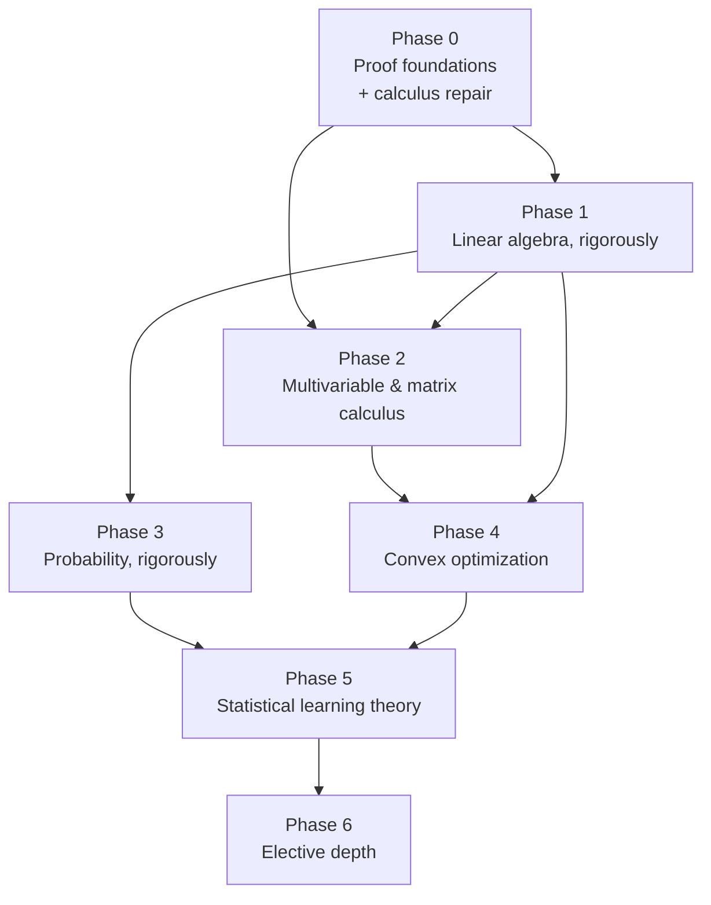

# Curriculum — Master Plan

> **This file defines the trajectory. The daily run does not.**
>
> The daily scheduled run is a *consumer* of this plan. It may propose amendments
> (append to §7), but it must not silently redefine the sequence. Trajectory
> changes happen at the weekly and monthly reviews, deliberately.

---

## 1. Destination

Two targets, chosen deliberately because they reinforce each other:

1. **ML at research depth.** Able to read a theory-flavored ML paper (an optimization
   convergence result, a generalization bound, a diffusion-model derivation) and
   follow *and verify* the math rather than pattern-matching the prose.
2. **Mathematical maturity.** Able to read and write proofs. Able to look at an
   unfamiliar definition and construct examples and counterexamples unprompted.

These are the same skill viewed from two sides. Research-depth ML is gated on proof
fluency far more than on topic coverage — most of what separates "I use Adam" from
"I can read the Adam convergence proof" is comfort with quantifiers, inequalities,
and linear-algebraic argument, not knowledge of more subjects.

**Explicitly de-scoped:** aerospace/GNC applications. The original repo header aimed at
"ML/AI and rockets/aerospace" simultaneously. Orbital mechanics and control theory are
genuinely interesting but the shared core with ML research is thinner than it looks
(ODEs and linear systems, mostly), and chasing both dilutes an hour a day into
neither. Rocket problems may reappear as *flavor* on optimization days. They no longer
drive sequencing.

---

## 2. Starting position

From the NYU transcript (BA, Computer and Data Science, completed Spring 2026):

| Course | Grade | Term | Read |
|---|---|---|---|
| Calculus I (MATH-UA 121) | A- | Fall 2022 | Solid, but four years cold |
| Discrete Mathematics (MATH-UA 120) | **C+** | Spring 2023 | **The signal.** Lowest grade on the transcript, and it is the proof-writing course |
| Calculus II (MATH-UA 122) | B+ | Fall 2023 | Mechanics present, not fluent |
| Linear Algebra (MATH-UA 140) | B+ | Spring 2024 | Computational pass. Not proof-based |
| Probability & Statistics (MATH-UA 235) | A- | Fall 2024 | Genuinely good; strongest math result |
| Fundamentals of Machine Learning (CSCI-UA 473) | A | Spring 2025 | Applied strength |
| Intro to Deep Learning & LLM-based GenAI (DS-UA 301) | A | Fall 2025 | Applied strength |
| Causal Inference (DS-UA 201) | A | Spring 2025 | Statistical reasoning is a strength |

**Never taken:** multivariable calculus, differential equations, real analysis,
numerical analysis, measure-theoretic probability, optimization.

### What this profile actually says

The applied/CS grades (A, A, A, A-) are consistently a full letter above the
formal-math grades (B+, B+, C+). That gap is not an accident of scheduling — it is a
description of the bottleneck. Alex can *use* mathematical machinery and reasons well
about statistical evidence, but the courses that demanded he *justify* things went
worst.

So: **the binding constraint is not topic coverage. It is proof fluency and a shaky
linear-algebra foundation.** A curriculum that races through new topics is optimizing
the wrong variable.

**Refined after week 1 (2026-08-24).** The calibration read this as a deep deficit; a
week of actual work says it was narrower than that. Alex cleared unfolding,
contrapositive vs. contradiction, contradiction proofs, injective/surjective and a
general pigeonhole proof inside four sessions, and produced genuine synthesis on the
last one. What was missing was proof *technique* — a small set of mechanical moves he
had never been taught — not reasoning ability. Teach the moves and he picks them up
fast. **Phase 0 shortened accordingly.** Phase 1 is unchanged: the Section B result
(rank defined as "the number of non-empty values") was about missing content, not
missing technique, and content takes the time it takes.

---

## 3. Operating constraints

- **~60 minutes/day, 5 days/week.** Roughly 250 sessions/year, ~21/month.
- Budget honestly: a semester-length university course is ~40 contact hours plus
  ~80 hours of problem sets. At 1 hr/day, **one real course is roughly 8–12 weeks**,
  not 4 days. The plan below is priced at that rate.
- The plan assumes days are missed. Phases are gated on **mastery, not dates**. Every
  date in §6 is an estimate, not a commitment, and slipping is expected and fine.

---

## 4. Prerequisite structure

Phase 1 is the hub. Everything downstream leans on it, which is why it gets the most
time and the strictest gate.

---

## 5. The phases

### Phase 0 — Proof foundations & calculus repair (3 weeks, ~15 sessions)

*The most important phase in this document, and the one most tempting to skip.*

**Progress:** sessions 1–5 done. Retired: unfolding definitions, direct proof,
contrapositive, contradiction, counterexamples, injective/surjective, pigeonhole.
Remaining: compound-predicate negation (in progress), ε-N arguments, quantifier order,
induction, sup/inf, Taylor with remainder.

- Logic and quantifiers: negation, order of quantifiers, vacuous truth. Why
  "for all ε > 0 there exists δ" is a game with a specific structure.
- Proof techniques: direct, contrapositive, contradiction, induction (weak and strong),
  proof by cases, constructing counterexamples.
- Sets, functions, relations: injection/surjection/bijection, images and preimages,
  equivalence relations.
- Supremum/infimum and the completeness of ℝ. First real encounter with ε-arguments.
- **Calculus repair, interleaved:** chain rule to genuine fluency (it is backprop),
  Taylor series with remainder, integration by parts (it is how expectations of
  transformed variables get computed), geometric and exponential series.

**Exit gate:** cold, closed-book, in one 60-minute session —
1. Prove √2 is irrational, and prove that between any two reals lies a rational.
2. Prove by induction that a set of size *n* has 2ⁿ subsets.
3. Negate, correctly and in words, a three-quantifier statement **with an implication
   at the bottom**, and say which rule you used at each step.
4. Give a function that is injective but not surjective, and one that is neither,
   with justification.
5. State the definition of sup and prove sup(A + B) = sup A + sup B for bounded sets.

Pass = 4 of 5 essentially correct, with proofs that would survive a grader.

---

### Phase 1 — Linear algebra, rigorously (8 weeks, ~40 sessions)

*Not "Linear Algebra II." The whole subject, redone as mathematics rather than as
matrix arithmetic.*

- Vector spaces from the axioms; subspaces, span, linear independence, basis,
  dimension — with the exchange-lemma proof that dimension is well-defined.
- **Linear maps as the primary object**, matrices as a representation in a chosen
  basis. Change of basis. This reframing is the single biggest conceptual upgrade
  available and is where the B+ course almost certainly stopped short.
- Rank–nullity, proved, not quoted.
- Inner product spaces, orthogonality, Gram–Schmidt, orthogonal projection,
  least squares as projection, QR.
- Eigenvalues/eigenvectors developed properly: invariant subspaces, characteristic
  and minimal polynomials, algebraic vs. geometric multiplicity, diagonalizability
  criteria, defective matrices.
- **The spectral theorem, with proof.**
- Quadratic forms, positive (semi)definiteness, the Rayleigh quotient and the
  variational characterization of eigenvalues.
- **SVD, derived from the spectral theorem**, Eckart–Young, pseudoinverse, and the
  four fundamental subspaces.
- Matrix norms, condition number, and why numerical linear algebra cares.

**Spine:** Axler, *Linear Algebra Done Right* (4th ed.) for the structure and proofs;
Strang, *Introduction to Linear Algebra* for computational grounding and applications.
Use both — Axler is deliberately determinant-light, and ML needs the determinant and
the matrix picture too.

**Why 8 weeks, unchanged even though Phase 0 shrank:** Phase 0 shortened because the
gap there was *technique*, which teaches fast. Phase 1's gap is *content* — Section B
scored ~5% and the definitions of rank, basis, and null space were absent or wrong.
Content does not compress the same way. Start from the axioms. Do not shorten this.

**Exit gate:** cold, closed-book, across two sessions —
1. Prove rank–nullity.
2. Prove the spectral theorem for real symmetric matrices.
3. Derive the SVD from the spectral theorem, including why the *uᵢ* come out orthonormal.
4. Given a small least-squares problem, solve it *as a projection* and explain the
   normal equations geometrically.
5. Produce a defective matrix and prove it is not diagonalizable.
6. Prove that a symmetric matrix is positive definite iff all eigenvalues are positive.

Pass = 5 of 6.

---

### Phase 2 — Multivariable & matrix calculus (5 weeks, ~25 sessions)

- The **total derivative as a linear map** — the definition that makes the chain rule
  obvious and makes backprop a one-line consequence rather than a mnemonic.
- Jacobians; the chain rule as composition of linear maps; **reverse-mode
  differentiation derived from it**.
- Gradients, directional derivatives, Hessians, Taylor's theorem in n dimensions
  with explicit remainder.
- Critical points, second-derivative test *stated in terms of Hessian eigenvalues*
  (the 2×2 determinant trick retired as a special case).
- Implicit and inverse function theorems (statement + use, proof optional).
- Lagrange multipliers, properly — including what λ *means* (shadow price), setting up
  the handoff to KKT in Phase 4.
- **Matrix calculus for ML:** ∂/∂X of tr(AX), XᵀAX, log det X, ‖Ax − b‖²; layout
  conventions; differentiating through a softmax and a cross-entropy loss.

**Note:** Days 1–4 of the original log covered partials → directional derivatives →
Hessian → Lagrange in four sessions. Treat that as a *preview*, not as completion —
and note that Days 3–5 were never actually attempted. Phase 2 revisits all of it at
the correct depth and with the linear-map framing that was missing.

**Exit gate:**
1. State the definition of differentiability at a point for f: ℝⁿ → ℝᵐ and use it to
   prove the chain rule.
2. Derive reverse-mode autodiff for a 3-layer MLP by hand.
3. Compute ∂/∂X log det X and ∂/∂X tr(XᵀAX) from first principles.
4. Solve a constrained optimization problem and interpret the multiplier numerically.

---

### Phase 3 — Probability, rigorously (6 weeks, ~30 sessions)

*Faster than its length suggests — the A- means intuition is already there. The work
is adding rigor and the linear-algebraic layer.*

- Probability spaces, σ-algebras, measurability (light touch — enough to know what a
  random variable *is*, not a full measure theory course).
- Expectation as an integral; LOTUS; existence and non-existence of moments.
- Joint/marginal/conditional distributions; independence vs. uncorrelatedness.
- **Covariance matrices as PSD matrices** — the Phase 1 payoff. Whitening, PCA
  re-derived as an eigenproblem on a covariance operator.
- The **multivariate Gaussian in full**: density derivation, conditioning and
  marginalization formulas, affine transformations, why it is the maximum-entropy
  distribution for fixed covariance.
- MGFs and Chernoff bounds.
- **Concentration:** Markov → Chebyshev → Hoeffding → Bernstein, each proved.
  This is the technical core of Phase 5 and the reason this phase precedes it.
- LLN and CLT: statements, proof sketch via characteristic functions.
- Conditional expectation as a projection (ties directly back to Phase 1).

**Exit gate:**
1. Prove Markov, then Chebyshev from Markov, then Hoeffding from the Chernoff method.
2. Derive the conditional distribution of a partitioned multivariate Gaussian.
3. Prove that a covariance matrix is always PSD.
4. Show E[X | Y] is the L² projection onto σ(Y)-measurable functions.

---

### Phase 4 — Convex optimization (6 weeks, ~30 sessions)

- Convex sets and functions; operations preserving convexity; the first- and
  second-order characterizations.
- Strong convexity, L-smoothness, and how the pair controls every convergence rate
  you will ever read.
- Optimality conditions; **duality**, weak and strong; Slater's condition; **KKT**
  (Lagrange multipliers, finally complete).
- Gradient descent: convergence proofs for convex, strongly convex, and smooth cases.
  Why the step size 1/L, and its relation to the Hessian's largest eigenvalue.
- Momentum/Nesterov, and the accelerated rate.
- SGD: variance, decreasing step sizes, and what the convergence guarantee actually
  promises about a neural network (spoiler: not much — understanding *why* is the point).
- Proximal methods, subgradients, and the ℓ¹/LASSO story.

**Spine:** Boyd & Vandenberghe, *Convex Optimization* (free PDF); supplemented by
Nesterov's introductory lectures for the rate proofs.

**Exit gate:**
1. Prove that gradient descent on an L-smooth, μ-strongly convex function converges
   linearly, and state the rate.
2. Derive the dual of a linearly constrained QP and verify strong duality.
3. Write the KKT conditions for SVM and interpret the support vectors.
4. Prove that the composition rules you used to certify a function convex are valid.

---

### Phase 5 — Statistical learning theory (6 weeks, ~30 sessions)

*Where "research depth" is actually earned.*

- Bias–variance decomposition, derived, and its honest limits in the modern regime.
- Empirical risk minimization; uniform convergence; why it is the right question.
- Union bound → finite hypothesis classes → VC dimension → Sauer's lemma → the
  fundamental theorem of PAC learning.
- Rademacher complexity and margin-based bounds.
- Stability and generalization; algorithmic-stability bounds for SGD.
- Why classical bounds fail to explain deep networks: double descent, interpolation,
  benign overfitting. Read a modern paper and verify its central inequality by hand.

**Exit gate:** read an assigned recent theory paper cold and (a) reproduce its main
proof, (b) state precisely which assumption is doing the work, (c) construct a
counterexample if that assumption is dropped.

---

### Phase 6 — Elective depth (open-ended)

Chosen at the Phase 5 review based on what is actually biting. Candidates:

- **Real analysis proper** (metric spaces, uniform convergence, measure theory) — if
  proofs still feel effortful.
- **Numerical linear algebra** (Trefethen & Bau) — if implementation is the interest.
- **Information theory** (Cover & Thomas) — the natural companion to Phase 3.
- **Differential geometry / optimization on manifolds** — if the interest turns
  geometric.
- **ODEs + linear systems + control** — the aerospace branch, if that pull returns.

---

## 6. Schedule shape

| Phase | Length | Sessions | Est. completion |
|---|---|---|---|
| 0 — Proof foundations | 3 wk | ~15 | early Sep 2026 |
| 1 — Linear algebra | 8 wk | ~40 | early Nov 2026 |
| 2 — Multivariable & matrix calculus | 5 wk | ~25 | mid Dec 2026 |
| 3 — Probability | 6 wk | ~30 | early Feb 2027 |
| 4 — Convex optimization | 6 wk | ~30 | late Mar 2027 |
| 5 — Statistical learning theory | 6 wk | ~30 | mid May 2027 |
| **Total to research-depth** | **~34 wk** | **~170** | **~May 2027** |

Nine months. That is the honest price of the stated destination at one hour a day.

> **Open question:** this table is priced at 5 sessions/week. Week 1 ran 4 of 5, which
> is fine. If the sustained rate settles nearer 3, re-price at ~55 weeks rather than
> letting it slip silently.

### Weekly shape

| Day | Session |
|---|---|
| Mon–Thu | New material: review block → problems → short consolidation note |
| Fri | **Review day. No new material.** Mixed retrieval across all prior phases + one synthesis problem |
| Weekend | Off. Optional: read ahead, no obligation |

One day in five spent purely on retrieval is not a 20% tax; it is the mechanism by
which the other 80% survives past a month.

---

## 7. Proposed amendments

*The daily run appends here when it believes the plan should change — a topic is
harder than budgeted, a prerequisite is missing, an exit gate is mis-specified. It
does not act on these unilaterally. Reviewed weekly.*

<!-- Format: - [YYYY-MM-DD] proposal — rationale -->

**[2026-08-24] Week 1 review. APPLIED — §5 and §6 updated above.**

- **Phase 0: 5 weeks → 3 weeks (~15 sessions).** Reverses the 2026-08-17 extension.
  Four sessions cleared unfolding, contrapositive vs. contradiction, contradiction
  proofs, injective/surjective, and a general pigeonhole proof — plus real synthesis on
  session 5. The calibration mistook missing *technique* for missing ability. Technique
  teaches fast.
- **Phase 1 stays at 8 weeks.** Its gap is content, not technique, and content doesn't
  compress. Noted explicitly in §5 so a future review doesn't shorten it by analogy.
- **Phase 0 exit gate item 3 sharpened** to require an implication at the bottom of the
  quantifier stack and the rule named at each step — the atomic/compound split is
  exactly where the real weakness sits, and the old wording would have passed someone
  who could only do the atomic case.

**Diagnosis worth recording: the ~25-session figure was partly an artifact of the run
rules, not the material.** Week 1 spent four consecutive sessions on the same
injective/surjective/pigeonhole cluster because (a) blank answers were graded as
failures, so one question skipped for time got re-issued indefinitely; (b) three
separate channels — the review queue, open-weaknesses, and yesterday's carry-forward —
all drew from the same failure list, so one miss appeared three times in one session;
(c) the retirement rule ("two clean retrievals at ≥7-day spacing") was unreachable at
five sessions a week, so nothing ever retired. Fixed in `RUN-PROMPT.md` 2026-08-24.

**Still deferred:**

- Calculus repair sizing. Taylor came back blank twice, so it moves from tested to
  taught (Wednesday). If that session shows the gap is wider than Taylor alone, promote
  calculus repair to ~4 dedicated sessions.

---

## 8. Review cadence

- **Weekly (Friday):** update `STATE.md`. Are we on the phase? Any amendments in §7
  to accept? Is the review queue backing up?
- **Monthly:** re-read this file. Is the destination still right? Are the phase
  lengths honest given actual throughput? Adjust §6 estimates to reality rather than
  pretending the original estimate held.
- **At each phase gate:** run the exit gate as a real, timed, closed-book assessment.
  Record the result in `STATE.md`. **Do not advance on a failed gate** — diagnose which
  sub-topic failed and spend a week there.
