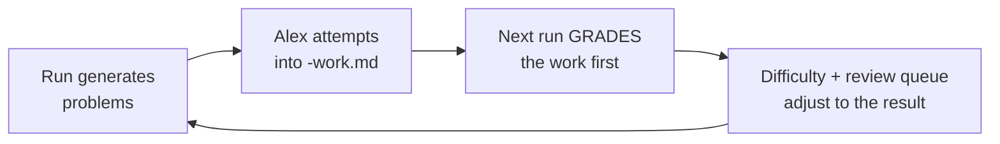

# Daily Math Practice

Self-directed mathematics, ~1 hour/day, 5 days/week, aimed at **ML at research depth**
and **mathematical maturity** (reading and writing proofs).

## Files

| File | Job | Who writes it |
|---|---|---|
| [`CURRICULUM.md`](CURRICULUM.md) | The master plan — destination, phases, prerequisites, exit gates | Alex, at monthly reviews |
| [`STATE.md`](STATE.md) | Where we are now — evidence log, rolling 10-session horizon, open weaknesses | The daily run |
| [`REVIEW-QUEUE.md`](REVIEW-QUEUE.md) | Spaced-repetition queue (1d → 3d → 7d → 21d → 60d) | The daily run |
| [`RUN-PROMPT.md`](RUN-PROMPT.md) | The prompt the scheduled task uses | Alex |
| [`progress.md`](progress.md) | Append-only historical log | The daily run |
| `lessons/` | Reference material, written once per topic — **not daily reading** | The daily run |
| `weeks/<monday>/` | `<MM-DD>.md` problems · `-work.md` your answers · `-solution.md` key (one day late) · `-feedback.md` grading | mixed |
| `diagnostics/` | Calibration and phase-gate assessments | The daily run |

## The hour

| | |
|---|---|
| **0–10 min** | Review block. Items due from the queue. **Cold — lesson files closed.** |
| **10–45 min** | Core problems. At least one requires a proof, not a computation. |
| **45–60 min** | Stretch problem (optional), then write up what was hard. |

Reading is not the session. The lesson files are a reference to consult when stuck, not
a chapter to read front to back. Producing mathematics is what moves the needle;
reading about it feels productive and mostly isn't.

## The loop

**Filling in `-work.md` is what makes this a system rather than a problem generator.**
Without it the run has no evidence, and its only honest move is to hold difficulty in
place. Partial work counts. Wrong work counts — wrong work is the most informative
thing in the repo.

## Rules that exist for a reason

1. **Solutions arrive one day late.** Today's answer key is deliberately not in the repo
   today. Struggling before seeing the answer is the mechanism; a solution file sitting
   one click away quietly removes it.
2. **Difficulty follows evidence, not the calendar.** No work recorded → hold. Never
   advance two levels in one day.
3. **One proof every day.** Even on computational topics.
4. **Fridays are review only.** No new material. One day in five is what keeps the other
   four from evaporating.
5. **Phase gates are real.** A failed gate means a week on what failed, not a soft roll
   into the next phase.
6. **The daily run doesn't set the trajectory.** It proposes amendments to
   `CURRICULUM.md` §7; Alex accepts them at the weekly review.

## Status

Phase 0 (proof foundations), not yet started. Next action: the
[calibration diagnostic](diagnostics/2026-08-18-calibration.md).
