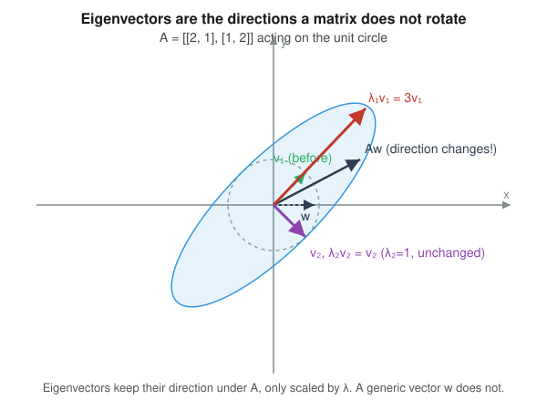
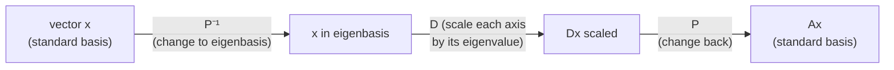
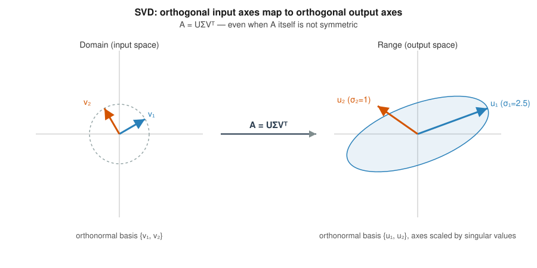

# Lesson: Linear Algebra II — Eigenvalues, Eigenvectors, and Matrix Decompositions

You already know how to solve $A\mathbf{x} = \mathbf{b}$ and reason about rank, span, and null spaces from Linear Algebra I. This lesson goes one level deeper: instead of asking "what does $A$ do to an arbitrary vector," we ask "are there special vectors whose *direction* $A$ leaves alone?" That question — eigenvalues and eigenvectors — turns out to be the single most reused idea in applied math. PCA compresses data along eigenvectors of a covariance matrix. Backprop-adjacent optimization theory judges whether a critical point is a minimum, maximum, or saddle using the eigenvalues of a Hessian (you saw the 2-variable version of this on Day 3 of multivariable calculus — today generalizes it). Rocket and aircraft attitude control lives or dies on whether the eigenvalues of a linearized dynamics matrix have negative real part (stable) or not. Google's PageRank is a dominant-eigenvector computation on the web graph. SVD, the generalization of eigendecomposition to non-square matrices, underlies recommender systems, image compression, and the low-rank structure exploited throughout modern ML.

## Learning objectives

By the end of this lesson you should be able to:

- Compute eigenvalues and eigenvectors of a matrix by hand via the characteristic polynomial, and explain what they mean geometrically.
- Diagonalize a matrix ($A = PDP^{-1}$) and use diagonalization to compute matrix powers efficiently.
- State and use the spectral theorem for symmetric matrices.
- Explain the Singular Value Decomposition ($A = U\Sigma V^\top$) geometrically and relate it to the eigendecomposition of $A^\top A$.
- Connect eigenvalues/eigenvectors to PCA, stability analysis, and low-rank approximation.

## 1. Vector spaces, basis, and dimension — quick refresher (foundational)

**Intuition.** A vector space is just a collection of objects (vectors) you're allowed to add and scale, and have those operations behave sensibly (associativity, a zero vector, etc.). A *basis* is a minimal set of vectors that can build every other vector in the space by linear combination, and no basis vector is redundant (they're linearly independent). The *dimension* is the number of vectors in any basis — it's a property of the space, not of any particular basis you chose.

**Formal definitions.** A set $\{\mathbf{v}_1, \dots, \mathbf{v}_k\}$ is a **basis** for a vector space $V$ if (1) it **spans** $V$ (every $\mathbf{w} \in V$ can be written $\mathbf{w} = \sum_i c_i \mathbf{v}_i$) and (2) it is **linearly independent** ($\sum_i c_i \mathbf{v}_i = \mathbf{0} \implies$ all $c_i = 0$). Every basis of $V$ has the same number of elements, $\dim(V)$ — this is why dimension is well-defined; if two bases had different sizes you could use a standard exchange argument to derive a contradiction (a linearly independent set can never be larger than a spanning set).

**Why it matters here:** eigenvectors, when there are enough of them, form an alternative basis for $\mathbb{R}^n$ — one in which the action of $A$ becomes *trivial* (just scaling). Most of this lesson is about exploiting that change of basis.

**Micro-example.** Is $\{(1,1), (1,-1)\}$ a basis for $\mathbb{R}^2$? It spans (any $(a,b) = \frac{a+b}{2}(1,1) + \frac{a-b}{2}(1,-1)$) and is independent (they're not scalar multiples of each other), and there are exactly 2 of them matching $\dim(\mathbb{R}^2)=2$, so yes.

**Common pitfall:** thinking a spanning set is automatically a basis. $\{(1,0),(0,1),(1,1)\}$ spans $\mathbb{R}^2$ but is not a basis (it's not independent — three vectors in a 2-dimensional space must be dependent).

## 2. Eigenvalues and eigenvectors (foundational → intermediate)

**Intuition.** Pick a matrix $A$ and think of it as a function that moves every point in space. Almost every vector gets both stretched/shrunk *and* rotated. But for most matrices, a few special directions exist that only get stretched or shrunk — never rotated off their own line. Those directions are the eigenvectors; the stretch factor for each is its eigenvalue.

**Formal definition.** $\mathbf{v} \neq \mathbf{0}$ is an **eigenvector** of $A$ with **eigenvalue** $\lambda$ (possibly complex) if
$$A\mathbf{v} = \lambda \mathbf{v}.$$
Rearranging, $(A - \lambda I)\mathbf{v} = \mathbf{0}$. Since $\mathbf{v} \neq \mathbf{0}$, this means $A - \lambda I$ is singular (not invertible), i.e.
$$\det(A - \lambda I) = 0.$$
This is the **characteristic equation**; its left side, expanded, is a degree-$n$ polynomial in $\lambda$ called the **characteristic polynomial**. Why does this work? A matrix is singular exactly when it collapses some nonzero vector to zero (its null space is nontrivial), and $\det(A-\lambda I)=0$ is precisely the algebraic condition for that. Once you have $\lambda$, you plug it back into $(A-\lambda I)\mathbf{v}=\mathbf{0}$ and solve for $\mathbf{v}$ by finding the null space — ordinary Gaussian elimination.

**Geometric picture.** See the figure below: $A = \begin{pmatrix}2&1\\1&2\end{pmatrix}$ has eigenvalues $\lambda_1=3$ (eigenvector $(1,1)$) and $\lambda_2=1$ (eigenvector $(1,-1)$). The unit circle gets mapped to an ellipse whose axes are exactly the eigenvector directions, stretched by the eigenvalues. A generic vector like $(1,0)$, by contrast, changes direction under $A$ — it is *not* an eigenvector.

**Micro-example.** Let $A = \begin{pmatrix}4&0\\0&-1\end{pmatrix}$. This is already diagonal, so its eigenvalues are just the diagonal entries: $\lambda_1=4$ with eigenvector $(1,0)$, $\lambda_2=-1$ with eigenvector $(0,1)$ (verify: $A(1,0)^\top=(4,0)^\top=4(1,0)^\top$ ✓). Diagonal matrices are the "already solved" case — the eigenvectors are just the standard basis vectors, which is exactly why diagonalization (Section 3) is so useful: it turns a general matrix into this easy case via a change of basis.

**Common pitfalls:**
- An eigenvalue of $0$ is completely valid — it just means $A$ collapses that direction entirely (singular matrix). Don't assume eigenvalues must be nonzero.
- Eigenvectors are only defined up to scalar multiple — $(1,1)$ and $(2,2)$ represent the "same" eigenvector direction. Software conventionally normalizes to unit length, but any nonzero scalar multiple is equally valid.
- A real $n\times n$ matrix can have complex eigenvalues (they come in conjugate pairs) — this happens exactly when the transformation involves genuine rotation, e.g. a pure 2D rotation matrix has no real eigenvectors at all except at special angles.

## 3. Diagonalization and the spectral theorem (intermediate)

**Intuition.** If $A$ has $n$ linearly independent eigenvectors, we can use them *as a new coordinate system*. In that coordinate system, $A$'s action is just "multiply each coordinate by its own eigenvalue" — no cross-terms, no rotation. This is diagonalization.

**Formal statement.** If $A$ (size $n \times n$) has $n$ linearly independent eigenvectors $\mathbf{v}_1,\dots,\mathbf{v}_n$ with eigenvalues $\lambda_1,\dots,\lambda_n$, let $P = [\mathbf{v}_1 \; \cdots \; \mathbf{v}_n]$ (eigenvectors as columns) and $D = \mathrm{diag}(\lambda_1,\dots,\lambda_n)$. Then
$$A = PDP^{-1}.$$
*Why this holds:* $AP = A[\mathbf{v}_1\cdots\mathbf{v}_n] = [A\mathbf{v}_1 \cdots A\mathbf{v}_n] = [\lambda_1\mathbf{v}_1 \cdots \lambda_n\mathbf{v}_n] = PD$, and since $P$ is invertible (its columns are independent by assumption), right-multiply by $P^{-1}$.

**Why you should care — matrix powers.** Computing $A^k$ directly requires $k-1$ matrix multiplications ($O(k n^3)$). But $A^k = PDP^{-1}PDP^{-1}\cdots = PD^kP^{-1}$, and $D^k$ is trivial (just raise each diagonal entry to the $k$-th power). This is exactly how closed-form solutions to linear recurrences (Fibonacci, Markov chain steady states, discretized linear ODEs — a preview of the next topic) are derived.

*Caption: diagonalization as a three-step pipeline. The matrix $A$ is hard to reason about directly; in the eigenbasis its action ($D$) is trivial. Repeating the middle step $k$ times computes $A^k$ almost for free.*

**Spectral theorem (symmetric matrices).** If $A = A^\top$ (symmetric, real entries), then $A$ is always diagonalizable, its eigenvalues are always real, and — crucially — its eigenvectors can always be chosen **orthonormal**. So for symmetric $A$: $A = Q\Lambda Q^\top$ with $Q$ orthogonal ($Q^\top Q = I$). This is not true for general (non-symmetric) matrices — their eigenvectors need not be orthogonal, or even real. This theorem is *why* covariance matrices (always symmetric) have such clean PCA behavior, and why Hessians (symmetric, by Clairaut's theorem, which you used in multivariable calc) have real eigenvalues that cleanly classify critical points.

**Micro-example — bridging to Day 3's Hessian test.** Recall the 2-variable second derivative test: $D = f_{xx}f_{yy} - f_{xy}^2$; if $D>0,f_{xx}>0$ it's a min, if $D>0,f_{xx}<0$ it's a max, if $D<0$ it's a saddle. This is *exactly* a disguised eigenvalue statement: the Hessian $H=\begin{pmatrix}f_{xx}&f_{xy}\\f_{xy}&f_{yy}\end{pmatrix}$ is symmetric, so by the spectral theorem it has two real eigenvalues $\lambda_1,\lambda_2$, and $\det(H)=\lambda_1\lambda_2$, $\mathrm{tr}(H)=\lambda_1+\lambda_2$. A minimum is exactly "both eigenvalues positive" (positive definite Hessian), a maximum is "both negative," a saddle is "mixed signs." The 2-variable determinant trick is a shortcut for exactly this, and it generalizes to $n$ variables *only* through eigenvalues — you can't write a simple determinant formula once $n>2$.

**Common pitfall:** not every matrix is diagonalizable. A matrix with a repeated eigenvalue but insufficient independent eigenvectors for that eigenvalue (a "defective" matrix, e.g. $\begin{pmatrix}1&1\\0&1\end{pmatrix}$) cannot be diagonalized — you'd need the more advanced Jordan normal form, which is out of scope here.

## 4. Singular Value Decomposition (intermediate → advanced)

**Intuition.** Eigendecomposition requires a square matrix, and even then, orthogonal eigenvectors are only guaranteed for symmetric matrices. What if you have a rectangular matrix (e.g. a $10000 \times 50$ data matrix), or a square-but-not-symmetric matrix? SVD is the fix: it *always* exists, for any matrix, and always gives you orthonormal bases on both the input and output side.

**Formal statement.** Any real $m \times n$ matrix $A$ can be written
$$A = U \Sigma V^\top$$
where $U$ ($m\times m$) and $V$ ($n\times n$) are orthogonal, and $\Sigma$ ($m \times n$) is diagonal with non-negative entries $\sigma_1 \geq \sigma_2 \geq \cdots \geq 0$ (the **singular values**). Geometrically (see figure below): $V$'s columns ($\mathbf{v}_i$, the **right singular vectors**) are an orthonormal basis for the input space; $U$'s columns ($\mathbf{u}_i$, **left singular vectors**) are an orthonormal basis for the output space; and $A$ maps $\mathbf{v}_i \mapsto \sigma_i \mathbf{u}_i$. The unit sphere in the input always maps to an ellipsoid in the output, and the singular vectors are exactly its principal axes.

**Why it always exists (sketch, not full proof):** consider $A^\top A$, which is always symmetric (and positive semi-definite) *even when $A$ is not symmetric or not square*. By the spectral theorem, $A^\top A = V \Lambda V^\top$ with orthonormal $V$ and real, non-negative eigenvalues $\lambda_i$. Set $\sigma_i = \sqrt{\lambda_i}$ and $\mathbf{u}_i = \frac{1}{\sigma_i}A\mathbf{v}_i$ (for $\sigma_i \neq 0$); one can check these $\mathbf{u}_i$ come out orthonormal automatically. So **the singular values of $A$ are the square roots of the eigenvalues of $A^\top A$, and the right singular vectors are the eigenvectors of $A^\top A$.** This is the practical way SVD is often computed and the key fact tying this section back to Section 2.

**Micro-example.** For $A = \begin{pmatrix}3&0\\0&0\end{pmatrix}$, $A^\top A = \begin{pmatrix}9&0\\0&0\end{pmatrix}$, eigenvalues $9, 0$, so singular values $\sigma_1=3,\sigma_2=0$. This matches intuition: $A$ only "does something" along the first axis and completely destroys the second.

**Low-rank approximation.** Truncating the sum $A = \sum_i \sigma_i \mathbf{u}_i \mathbf{v}_i^\top$ to the top $k$ terms gives the *best possible* rank-$k$ approximation to $A$ in a precise sense (Eckart–Young theorem). This is the mathematical basis for PCA-based dimensionality reduction, image/data compression, and recommender systems (matrix factorization).

**Common pitfall:** confusing eigendecomposition and SVD. They coincide only for symmetric positive semi-definite matrices. In general, eigenvalues can be negative or complex and eigenvectors need not be orthogonal; singular values are always real and non-negative and singular vectors are always orthonormal — that's the whole point of using SVD for non-symmetric or rectangular matrices.

## 5. Other matrix decompositions — a brief map (advanced)

You'll mostly use eigendecomposition and SVD in ML contexts, but it's worth knowing the broader landscape you'll encounter in numerical linear algebra and optimization:

- **LU decomposition** ($A = LU$, lower/upper triangular): the matrix version of Gaussian elimination, used to solve $A\mathbf{x}=\mathbf{b}$ efficiently for many different $\mathbf{b}$'s without redoing elimination each time.
- **QR decomposition** ($A = QR$, $Q$ orthogonal, $R$ upper triangular): built from Gram–Schmidt orthogonalization; the standard numerically stable way to solve least-squares problems, and the workhorse inside the algorithm that computes eigenvalues numerically (the "QR algorithm").
- **Cholesky decomposition** ($A = LL^\top$, valid when $A$ is symmetric positive definite): a specialized, roughly 2x-faster "square root" of LU for the positive-definite case (e.g. covariance matrices), heavily used in sampling from multivariate Gaussians and in Gaussian process regression.

## Connections

- **PCA.** Given a data matrix, PCA finds the eigenvectors of the (symmetric) covariance matrix. The top eigenvectors are the directions of maximum variance; the eigenvalues are the variance captured along each. Equivalently, PCA is the SVD of the (centered) data matrix — the right singular vectors are the principal components.
- **Backprop / loss landscapes.** The Hessian of a loss function is symmetric, so its eigenvalues classify critical points exactly as in Section 3's micro-example, generalized to millions of parameters. The largest eigenvalue of the Hessian (found via power iteration, itself an eigenvector algorithm) controls the maximum stable learning rate in gradient descent.
- **Spectral graph theory / GNNs.** Eigenvectors of a graph's Laplacian matrix underlie spectral clustering and are the basis for spectral graph convolutional networks.
- **PageRank.** The ranking vector is the dominant eigenvector (eigenvalue 1) of a stochastic web-link matrix, found via power iteration.
- **Rockets/aerospace — stability.** Linearize a rocket or aircraft's equations of motion around a trim condition to get $\dot{\mathbf{x}} = A\mathbf{x}$. The eigenvalues of $A$ (the system's "poles") determine stability: negative real parts mean disturbances decay (stable flight), positive real parts mean they grow (the vehicle tumbles) — this is the direct bridge into next topic's ODEs and, later, control theory.
- **Recommender systems / compression.** Low-rank SVD approximation is literally how classical collaborative filtering (e.g. the Netflix Prize-era methods) and JPEG-style compression work.

## Cheat sheet

| Concept | Formula | Key fact |
|---|---|---|
| Eigenvalue equation | $A\mathbf{v}=\lambda\mathbf{v}$ | $\mathbf{v}$'s direction is preserved by $A$ |
| Characteristic equation | $\det(A-\lambda I)=0$ | Roots are the eigenvalues |
| Diagonalization | $A = PDP^{-1}$ | Requires $n$ independent eigenvectors |
| Matrix powers | $A^k = PD^kP^{-1}$ | $D^k$ just raises diagonal entries to the $k$-th power |
| Spectral theorem | $A=A^\top \implies A=Q\Lambda Q^\top$, $Q$ orthogonal | Real eigenvalues, orthonormal eigenvectors |
| SVD | $A=U\Sigma V^\top$, always exists | $\sigma_i=\sqrt{\lambda_i(A^\top A)}$ |
| Low-rank approximation | truncate $\sum_i \sigma_i\mathbf{u}_i\mathbf{v}_i^\top$ to top $k$ | Best possible rank-$k$ approximation (Eckart–Young) |
| Trace / determinant shortcuts ($2\times2$) | $\mathrm{tr}(A)=\lambda_1+\lambda_2$, $\det(A)=\lambda_1\lambda_2$ | Fast sanity check on computed eigenvalues |

Today's problems exercise the foundational layer of this lesson: computing eigenvalues/eigenvectors by hand from the characteristic polynomial, and reading them geometrically — including one problem that connects them directly back to the Hessian test from the multivariable calculus unit.
