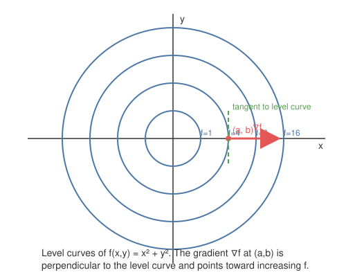
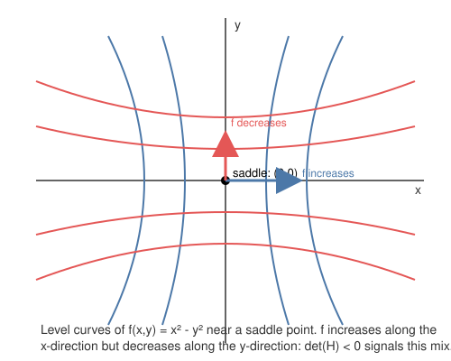
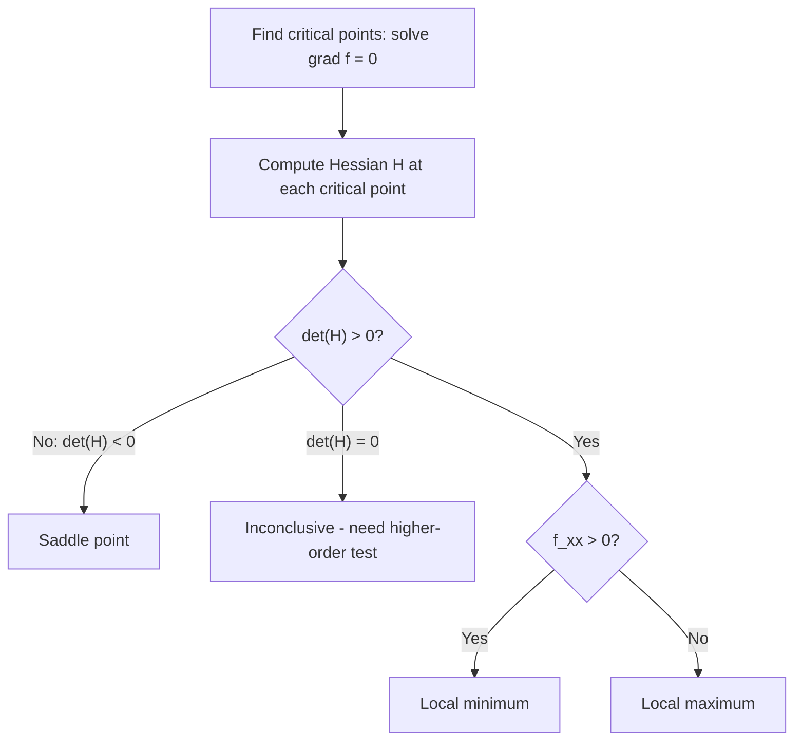
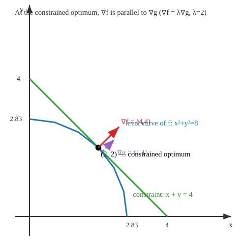

# Lesson: Multivariable Calculus

Single-variable calculus tells you how a function changes along a line. Almost nothing you'll build in ML or aerospace lives on a line: a neural network's loss is a function of millions of weights, a rocket's state depends on position, velocity, and attitude simultaneously, and a control system's cost surface is a function of every tunable gain at once. Multivariable calculus is the language for "which way is uphill" and "what does the shape of the surface around me look like" in those high-dimensional settings. Gradient descent, backpropagation, Newton's method, and trajectory optimization are all, underneath, multivariable calculus applied mechanically.

## Learning objectives

- Compute partial derivatives and assemble them into the gradient vector.
- Interpret the gradient geometrically: direction of steepest ascent, perpendicular to level curves.
- Compute directional derivatives and use them to find steepest ascent/descent in any direction.
- Compute the Hessian matrix and apply the second derivative test to classify critical points as minima, maxima, or saddle points.
- Solve constrained optimization problems with Lagrange multipliers, and interpret the multiplier itself.
- Connect all of the above to gradient descent, loss landscapes, and optimization problems in ML and aerospace.

---

## 1. Partial Derivatives and the Gradient (foundational)

### Intuition

If $f(x,y)$ is a surface — think of it as elevation over a map with coordinates $x$ and $y$ — a partial derivative asks: "if I stand at a point and only allow myself to move in the $x$-direction (freezing $y$), how fast does elevation change?" You already know how to answer this: treat every other variable as a constant and differentiate as in single-variable calculus.

### Formal definition

$$\frac{\partial f}{\partial x} = \lim_{h \to 0} \frac{f(x+h, y) - f(x,y)}{h}, \qquad \frac{\partial f}{\partial y} = \lim_{h \to 0} \frac{f(x, y+h) - f(x,y)}{h}$$

These are just single-variable derivatives with the other variable held fixed — the limit definition makes that explicit, since only one coordinate moves.

The **gradient** packages both partials into a vector:

$$\nabla f(x,y) = \left( \frac{\partial f}{\partial x}, \frac{\partial f}{\partial y} \right)$$

This generalizes directly to $n$ variables: $\nabla f = \left(\frac{\partial f}{\partial x_1}, \ldots, \frac{\partial f}{\partial x_n}\right)$.

**Why the gradient matters:** it turns out $\nabla f$ points in the direction in which $f$ increases *fastest*, and $\|\nabla f\|$ is the rate of that increase. That fact isn't obvious yet from the definition — it falls out of the directional derivative in Section 2. It's the single most-used fact in this lesson: every gradient descent step, every backprop update, is "take a small step in the direction of $-\nabla f$."

### Worked micro-example

Let $f(x,y) = x^2y + \sin(y)$.

$$\frac{\partial f}{\partial x} = 2xy, \qquad \frac{\partial f}{\partial y} = x^2 + \cos(y)$$

At $(1, 0)$: $\nabla f(1,0) = (2 \cdot 1 \cdot 0,\ 1^2 + \cos(0)) = (0, 2)$.

### Diagram

### Common pitfalls

- Forgetting that "constant" includes every *other* variable, not just literal numbers — when differentiating w.r.t. $x$, a term like $x^2y$ treats $y$ as a coefficient, so $\frac{\partial}{\partial x}(x^2y) = 2xy$, not $2x$.
- Writing the gradient as a scalar. It is always a vector with one component per input variable — dimensions must match the number of inputs.

---

## 2. Directional Derivatives and Steepest Ascent (foundational+)

### Intuition

Partial derivatives only tell you the rate of change along the coordinate axes. But you can walk in *any* direction from a point — northeast, at some angle, along a diagonal. The directional derivative generalizes "how fast does $f$ change" to an arbitrary direction $\mathbf{u}$.

### Formal definition

For a unit vector $\mathbf{u} = (u_1, u_2)$, the directional derivative of $f$ at $(x,y)$ in direction $\mathbf{u}$ is

$$D_{\mathbf{u}} f(x,y) = \nabla f(x,y) \cdot \mathbf{u} = \frac{\partial f}{\partial x}u_1 + \frac{\partial f}{\partial y}u_2$$

**Why this formula holds:** think of moving along the line $(x,y) + t\mathbf{u}$ and differentiating $f$ with respect to $t$ at $t=0$. By the multivariable chain rule, $\frac{d}{dt}f(x+tu_1, y+tu_2)\Big|_{t=0} = \frac{\partial f}{\partial x}u_1 + \frac{\partial f}{\partial y}u_2$ — exactly the dot product $\nabla f \cdot \mathbf{u}$. This is why $\mathbf{u}$ must be a *unit* vector: the formula measures the rate of change per unit distance traveled, and if $\mathbf{u}$ weren't normalized, you'd be mixing "speed of travel" into "rate of change," corrupting the comparison across directions.

**Steepest ascent:** since $\nabla f \cdot \mathbf{u} = \|\nabla f\| \|\mathbf{u}\| \cos\theta = \|\nabla f\|\cos\theta$ (as $\|\mathbf{u}\|=1$), and $\cos\theta$ is maximized at $\theta = 0$ (i.e., $\mathbf{u}$ points exactly along $\nabla f$), the directional derivative is maximized when $\mathbf{u} = \nabla f / \|\nabla f\|$. That maximum value is $\|\nabla f\|$. This is the proof of the fact asserted in Section 1: **the gradient points in the direction of steepest ascent, and its magnitude is the steepest rate of increase.** Steepest descent is the opposite direction, $-\nabla f/\|\nabla f\|$, with rate $-\|\nabla f\|$.

### Worked micro-example

Let $f(x,y) = xy^2$. At $(2,1)$: $\nabla f(2,1) = (y^2, 2xy) = (1, 4)$.

Directional derivative toward $\mathbf{v} = (1,1)$: normalize first, $\mathbf{u} = \frac{1}{\sqrt{2}}(1,1)$.

$$D_{\mathbf{u}}f(2,1) = (1,4)\cdot\frac{1}{\sqrt{2}}(1,1) = \frac{1+4}{\sqrt{2}} = \frac{5}{\sqrt{2}} \approx 3.54$$

Sanity check: this should be less than $\|\nabla f(2,1)\| = \sqrt{1^2+4^2} = \sqrt{17}\approx 4.12$, since $(1,1)$ isn't perfectly aligned with $\nabla f=(1,4)$. Indeed $3.54 < 4.12$. ✓.

### Common pitfalls

- Using a non-unit vector directly in the dot product. If given $\mathbf{v}=(3,4)$, you must divide by $\|\mathbf{v}\|=5$ before dotting with $\nabla f$, or the "directional derivative" will be scaled by $\|\mathbf{v}\|$ and no longer means "rate of change per unit distance."
- Confusing the *direction* of steepest ascent (the unit vector $\nabla f/\|\nabla f\|$) with the *rate* (the scalar $\|\nabla f\|$) — they answer different questions.

---

## 3. Critical Points, the Hessian, and the Second Derivative Test (intermediate)

### Intuition

In single-variable calculus, you find extrema by setting $f'(x)=0$ and using $f''(x)$ to classify the point (concave up → min, concave down → max). Multivariable calculus does the same thing, but "concavity" now has to account for *every direction at once* — a surface can curve upward in one direction and downward in another. That's exactly a saddle point: think of a mountain pass, or (very relevantly) the loss landscape of a neural network, which is riddled with saddle points in high dimensions.

### Formal definitions

A **critical point** of $f(x,y)$ is a point where $\nabla f = (0,0)$ — both partials vanish simultaneously, so there's no direction of instantaneous increase or decrease to first order.

The **Hessian matrix** collects all second partial derivatives:

$$H(x,y) = \begin{pmatrix} f_{xx} & f_{xy} \\ f_{yx} & f_{yy} \end{pmatrix}$$

(For smooth $f$, $f_{xy}=f_{yx}$ by Clairaut's theorem — mixed partials commute — so $H$ is symmetric.)

**Second derivative test:** let $D = \det(H) = f_{xx}f_{yy} - f_{xy}^2$ at a critical point. Then:

- If $D > 0$ and $f_{xx} > 0$: **local minimum** (surface curves upward in every direction).
- If $D > 0$ and $f_{xx} < 0$: **local maximum** (curves downward in every direction).
- If $D < 0$: **saddle point** (curves upward in some directions, downward in others).
- If $D = 0$: inconclusive — need higher-order information.

**Why this works:** $D>0$ means the Hessian's two eigenvalues share a sign (both determine curvature along the Hessian's principal axes — the directions in which the quadratic approximation of $f$ is a pure "bowl" or "dome"). Same sign in both principal directions means the surface bends the same way everywhere near the point — a true min or max. $D<0$ means the eigenvalues have opposite signs: the surface bends up along one principal axis and down along the other, which is precisely a saddle. ($f_{xx}$ alone decides min vs. max once you know both eigenvalues share its sign.)

### Worked micro-example

Let $f(x,y) = x^2 + y^2 - 2x - 4y + 5$.

$\nabla f = (2x-2,\ 2y-4) = (0,0) \Rightarrow x=1, y=2$. One critical point: $(1,2)$.

$H = \begin{pmatrix}2 & 0\\0 & 2\end{pmatrix}$, so $D = 2\cdot2 - 0^2 = 4 > 0$, and $f_{xx}=2>0$ ⟹ **local minimum** at $(1,2)$.

(Sanity check: this $f$ is just $(x-1)^2+(y-2)^2+0$ after completing the square, obviously a bowl with minimum at $(1,2)$ — matches.)

### Diagrams

### Common pitfalls

- Forgetting to check *all* solutions of $\nabla f = 0$ — a function can have several critical points (see today's stretch problem), each needing its own Hessian evaluation.
- Assuming $f_{xx}>0$ alone guarantees a minimum. It doesn't — you need $D>0$ *first* to know the point isn't a saddle; $f_{xx}$'s sign only disambiguates min vs. max once $D>0$ is established.
- Sign errors in $D = f_{xx}f_{yy} - f_{xy}^2$: the cross term is *subtracted*, and it's $f_{xy}^2$ (always $\geq 0$), not $f_{xy}$.

---

## 4. Constrained Optimization: Lagrange Multipliers (advanced)

### Intuition

Everything so far optimized $f$ over the *entire* plane — go wherever you like. Real problems are rarely that free: you want the neural net's weights to sum to a fixed norm, or a rocket's three thrusters to deliver a *fixed total* thrust while minimizing wasted energy, or a probability distribution's entries to sum to 1. These are optimization problems *restricted to a curve or surface* — the constraint set. Lagrange multipliers are the tool for finding optima under exactly this kind of restriction.

The key geometric idea: imagine walking along the constraint curve $g(x,y)=c$ while watching the level curves of $f$ you cross. As long as you're crossing level curves *transversally* (at an angle), you can always take a small step further along the constraint that increases (or decreases) $f$ a bit more — so you haven't found the optimum yet. You only stop being able to improve when the constraint curve is **tangent** to a level curve of $f$: at that instant, moving along the constraint keeps you on the same level curve to first order. Since the gradient of a function is always perpendicular to its own level curves, tangency of the two curves is equivalent to their gradients being *parallel*.

### Formal statement

To optimize $f(x,y)$ subject to $g(x,y) = c$, solve the system

$$\nabla f(x,y) = \lambda \nabla g(x,y), \qquad g(x,y) = c$$

for $(x,y,\lambda)$ — the scalar $\lambda$ is the **Lagrange multiplier**. Written out in components, this is three equations ($f_x = \lambda g_x$, $f_y = \lambda g_y$, $g(x,y)=c$) in three unknowns.

**Why this holds:** as argued above, at a constrained optimum the level curve of $f$ must be tangent to the constraint curve, so their normal vectors — which are exactly $\nabla f$ and $\nabla g$ — must point along the same line. "Same line" means one is a scalar multiple of the other: $\nabla f = \lambda \nabla g$. If instead $\nabla f$ had a component *along* the constraint curve (not just perpendicular to it), you could move along the curve in that direction and strictly improve $f$, contradicting optimality.

**The Lagrangian trick:** define $\mathcal{L}(x,y,\lambda) = f(x,y) - \lambda\big(g(x,y) - c\big)$. Taking partial derivatives and setting them to zero reproduces the exact same system: $\partial \mathcal{L}/\partial x = f_x - \lambda g_x = 0$, $\partial \mathcal{L}/\partial y = f_y - \lambda g_y = 0$, and $\partial \mathcal{L}/\partial \lambda = -(g(x,y)-c) = 0$. So "find the unconstrained critical points of $\mathcal{L}$" is *equivalent* to "solve the constrained problem." This trick scales cleanly to many constraints (one multiplier $\lambda_i$ per constraint $g_i(x,\ldots)=c_i$) and many variables — it's the exact mechanism behind the dual formulation of support vector machines (one multiplier per margin constraint) and behind KKT conditions, the general first-order optimality conditions used throughout constrained ML and engineering optimization.

**What $\lambda$ means:** it isn't just bookkeeping — one can show $\dfrac{\partial f^\star}{\partial c} = \lambda$, i.e. $\lambda$ measures how much the optimal value of $f$ would improve per unit relaxation of the constraint. This is the mathematical basis for "shadow prices" in economics and sensitivity analysis in engineering design (e.g., how much would relaxing a thrust budget by 1 N reduce minimum energy expenditure?).

### Worked micro-example

Minimize $f(x,y) = x^2+y^2$ subject to $g(x,y) = x+y = 4$.

Set up: $\nabla f = (2x, 2y)$, $\nabla g = (1,1)$. The system $\nabla f = \lambda \nabla g$ gives $2x = \lambda$ and $2y=\lambda$, so $2x=2y \Rightarrow x=y$. Substituting into the constraint $x+y=4$ gives $2x=4 \Rightarrow x=y=2$, and $\lambda = 4$.

So the constrained minimum is at $(2,2)$, with value $f(2,2) = 4+4 = \boxed{8}$.

Geometric sanity check: the level curve $x^2+y^2=8$ is a circle of radius $\sqrt{8}\approx 2.83$ centered at the origin. The line $x+y=4$ is tangent to this exact circle at $(2,2)$ — any smaller circle ($x^2+y^2<8$) doesn't reach the line at all, and any larger circle crosses it at two points rather than touching it once. That's the geometric meaning of "the smallest value of $f$ achievable while staying on the line."

### Diagram

### Common pitfalls

- Forgetting the constraint equation itself. $\nabla f = \lambda \nabla g$ alone is two equations in three unknowns ($x,y,\lambda$) — underdetermined. You always need $g(x,y)=c$ as the third equation.
- Assuming the sign of $\lambda$ tells you min vs. max. It doesn't, on its own — classifying which critical point of $\mathcal{L}$ is a min vs. max vs. saddle-on-the-constraint requires more care (a bordered Hessian, beyond this lesson). In practice, when the constraint set is closed and bounded (like a circle or a plane through the origin intersected with a budget line), just evaluate $f$ at *every* candidate point found and compare — the Extreme Value Theorem guarantees a global min and max exist among them.
- Treating $\lambda$ as part of the answer. The answer to "optimize $f$ subject to $g=c$" is the point $(x,y)$ and the optimal value of $f$; $\lambda$ is an auxiliary variable (though, per above, a meaningful one — it's not to be discarded without a glance).

---

## Connections

- **ML/AI:** the loss surface of a neural network is a high-dimensional $f(\mathbf{w})$. Gradient descent is literally "repeatedly step in the direction of $-\nabla f$" (Section 2). Saddle points (Section 3) are the dominant obstacle in high-dimensional non-convex optimization — far more common than true local minima — which is why modern optimizers (Adam, momentum) are designed partly to escape them. The Hessian also shows up directly in second-order methods like Newton's method and in analyzing the curvature of loss basins ("sharp" vs. "flat" minima and generalization).
- **Systems/backprop:** backpropagation is the chain rule applied to a computational graph of partial derivatives — every gradient in a neural network is a giant, structured application of Section 1's partial derivatives, computed efficiently via the multivariable chain rule.
- **Aerospace:** a rocket's cost function for trajectory optimization (fuel used, terminal error) is a multivariable function of control inputs over time. Finding the best trajectory means finding critical points of that cost function, and the Hessian determines whether a candidate trajectory is a genuine local optimum or a saddle in control-input space — the same machinery as Section 3, just with far more variables.
- **Constrained optimization (Section 4):** Lagrange multipliers are the backbone of the dual SVM formulation (one multiplier per training point's margin constraint) and of KKT conditions, which govern essentially all constrained training and control problems in ML — e.g. training under a weight-norm budget. In aerospace and control systems, minimum-energy or minimum-fuel control allocation across multiple actuators subject to a total-output budget (today's stretch problem) is a direct, real engineering application of exactly this machinery.

## Summary / cheat sheet

| Concept | Formula | Meaning |
|---|---|---|
| Partial derivative | $\frac{\partial f}{\partial x}$ | Rate of change holding other variables fixed |
| Gradient | $\nabla f = (f_x, f_y)$ | Vector of all partials; points toward steepest increase |
| Directional derivative | $D_{\mathbf u}f = \nabla f \cdot \mathbf u$, $\|\mathbf u\|=1$ | Rate of change in direction $\mathbf u$ |
| Steepest ascent direction | $\mathbf u = \nabla f / \|\nabla f\|$ | Direction of fastest increase, rate $\|\nabla f\|$ |
| Critical point | $\nabla f = \mathbf 0$ | Candidate extremum |
| Hessian | $H = \begin{pmatrix}f_{xx}&f_{xy}\\f_{xy}&f_{yy}\end{pmatrix}$ | Matrix of second partials; encodes local curvature |
| Second derivative test | $D=\det H = f_{xx}f_{yy}-f_{xy}^2$ | $D>0,f_{xx}>0$: min. $D>0,f_{xx}<0$: max. $D<0$: saddle |
| Constrained optimum condition | $\nabla f = \lambda \nabla g$, with $g(x,y)=c$ | Level curve of $f$ tangent to constraint $g=c$ |
| Lagrangian | $\mathcal{L}(x,y,\lambda) = f(x,y) - \lambda(g(x,y)-c)$ | Unconstrained critical points of $\mathcal{L}$ recover the constrained optimum |

Today's problems exercise the Hessian / second derivative test as a warm-up, then Lagrange multipliers on a two-variable problem (core) and a three-variable minimum-energy control allocation problem in the style of thrust budgeting across rocket thrusters (stretch).
