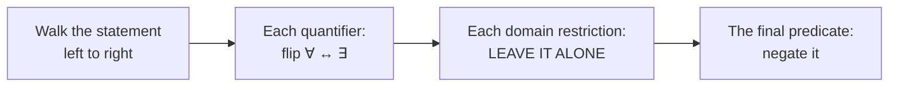

# Lesson: Proof Foundations

**Phase 0 reference. ~5 weeks of material.**

> ## Do not read this end to end.
>
> This is a handbook, not a chapter. Each session points you at one or two sections.
> Read those, do the problems, come back. Reading all of this in one sitting is the
> single easiest way to waste an hour and feel productive doing it.

---

## Why this phase exists

You can already *use* mathematical machinery — the ML grades say so. What the
calibration showed is that you can't yet *justify* it. That's a different skill and it
is the one that gates everything downstream: convex optimization is a sequence of
inequality proofs, statistical learning theory is a sequence of quantifier arguments,
and rigorous linear algebra is a sequence of "suppose $\sum c_i v_i = 0$…" moves.

Three specific things went wrong ([full diagnosis](../diagnostics/2026-08-18-calibration-feedback.md)),
and this file is organized around them:

| Bug | Section |
|---|---|
| **#1** Frame a proof, then stop before executing | **§1** |
| **#2** Induction with no engine — the hypothesis is never used | **§6** |
| **#3** Negation flips domain restrictions instead of quantifiers | **§5** |

---

## 0. What a proof actually is

A proof is a finite sequence of claims where **each one follows from the definitions,
the hypotheses, or a claim you already made** — and a skeptical reader can check every
step without trusting you.

That's the whole thing. Not "a convincing argument," not "an explanation." A checkable
chain.

Two consequences worth internalizing:

- **Every word in the statement must get used.** If the hypothesis says "let $n$ be
  even" and your proof never mentions evenness, something is wrong.
- **"Obviously" is where proofs go to die.** If a step is obvious, it's usually one
  line to write, so write it. If it takes a paragraph to justify, it wasn't obvious.

### The anatomy

```
Claim.        [the statement, precisely]
Proof.
  Setup:      name the objects, state what you're assuming
  Unfold:     replace every defined word with its definition   ← §1
  Work:       algebra / logic, each step justified
  Land:       show you've arrived at exactly what was claimed
∎
```

Your A1 answer had Setup and stopped. Setup is maybe 20% of a proof — it's the part
that feels like thinking, so it's the part that feels like enough.

---

## 1. The move you're missing: unfold the definition

**If you are stuck, this is almost always the next step.** Take the defined word in
your hypothesis, replace it with what it literally means, and start computing.

### The definitions you should know cold

| Word | Means |
|---|---|
| $n$ is **even** | $\exists k \in \mathbb{Z}$ such that $n = 2k$ |
| $n$ is **odd** | $\exists k \in \mathbb{Z}$ such that $n = 2k+1$ |
| $a$ **divides** $b$ (written $a \mid b$) | $\exists k \in \mathbb{Z}$ such that $b = ak$ |
| $r$ is **rational** | $\exists p, q \in \mathbb{Z}$, $q \neq 0$, with $r = p/q$ |
| $f$ is **injective** | $f(a) = f(b) \implies a = b$ |
| $f$ is **surjective** | $\forall y$ in the codomain, $\exists x$ with $f(x) = y$ |
| $\{v_1,\dots,v_k\}$ is **linearly independent** | $\sum_i c_i v_i = 0 \implies$ every $c_i = 0$ |

Notice how many of these are secretly $\exists$ statements. "Even" doesn't mean
"divisible by 2" as a vibe — it means *there is an integer $k$ with $n = 2k$*, and the
proof move is to **name that $k$ and use it**.

### Worked micro-example

**Claim.** If $n$ is odd then $n^2$ is odd.

*Proof.* Suppose $n$ is odd. **Unfold:** then $n = 2k+1$ for some $k \in \mathbb{Z}$.
**Work:**
$$n^2 = (2k+1)^2 = 4k^2 + 4k + 1 = 2(2k^2 + 2k) + 1.$$
**Land:** since $2k^2 + 2k \in \mathbb{Z}$, this has the form $2m+1$, so $n^2$ is odd. ∎

That's it. Three lines. The entire content is "write down what odd means, square it,
notice the answer has the same shape."

### The trap

Writing $n \bmod 2 = 1$ instead of $n = 2k+1$. Both are true, but the first is a
*test* and the second is a *handle* — you can substitute $2k+1$ into an expression and
compute with it. Modular notation is fine once you're fluent in modular arithmetic;
until then, name the integer.

---

## 2. Direct proof

Assume the hypothesis, unfold, compute, land on the conclusion. §1 above is a direct
proof. This is the default; reach for anything else only when the default stalls.

---

## 3. Contrapositive

$$P \implies Q \qquad\text{is logically equivalent to}\qquad \lnot Q \implies \lnot P.$$

Not the converse ($Q \implies P$, which is a *different statement*), and not the
inverse ($\lnot P \implies \lnot Q$, also different). Only the contrapositive is
equivalent.

**When to use it:** when $\lnot Q$ is more concrete to work with than $Q$.

That's exactly the situation in A1. "$n$ is even" is a positive, handle-able statement;
"$n^2$ is even" is too, but the *implication direction* is awkward — from "$n^2 = 2m$"
you can't easily extract information about $n$. Flip it:

**Claim.** If $n^2$ is even then $n$ is even.
**Contrapositive.** If $n$ is odd then $n^2$ is odd. ← already proved in §1. Done.

One line of setup, and the work was already done. Compare that to setting up a
contradiction and grinding.

---

## 4. Contradiction

Assume the statement is **false** and derive something impossible.

To negate $P \implies Q$ you assume $P$ **and** $\lnot Q$. (You got this right in A1 —
it's the step most people miss.)

**When to use it:** when the conclusion is a *non-existence* or *irrationality* claim —
something with no positive handle to grab. "There is no largest prime." "$\sqrt{2}$ is
not rational."

### Worked: $\sqrt 2$ is irrational

*Proof.* Suppose not: $\sqrt 2 = p/q$ with $p, q \in \mathbb{Z}$, $q \neq 0$, and the
fraction in lowest terms (so $p,q$ share no common factor).

Then $2 = p^2/q^2$, so $p^2 = 2q^2$, so $p^2$ is even, so **by §1's contrapositive**
$p$ is even. Write $p = 2k$. Then $4k^2 = 2q^2$, so $q^2 = 2k^2$, so $q^2$ is even, so
$q$ is even.

But then $p$ and $q$ are both even, contradicting "lowest terms." ∎

Note the reuse: the whole proof turns on the A1 lemma. Small proved facts compound.

### Contradiction vs. contrapositive

**Contrapositive** proves $\lnot Q \implies \lnot P$ and stops. **Contradiction**
assumes $P \wedge \lnot Q$ and hunts for *any* absurdity — heavier, because you carry an
extra assumption and don't know in advance what will break. **Prefer the contrapositive
when both apply.**

---

## 5. Quantifiers and negation

**The highest-leverage section in this file.** One mechanical rule, and it unlocks every
ε-argument in analysis, every convergence proof, and every generalization bound in
Phase 5.

### The two rules

$$\lnot\big(\forall x \in S,\ P(x)\big) \;\equiv\; \exists x \in S,\ \lnot P(x)$$
$$\lnot\big(\exists x \in S,\ P(x)\big) \;\equiv\; \forall x \in S,\ \lnot P(x)$$

Read them in words: *"not everything works" means "something fails."* *"nothing works"
means "everything fails."*

### The critical distinction: quantifier vs. domain restriction

In $\forall \varepsilon > 0$, there are two separate pieces:

- $\forall \varepsilon$ — **the quantifier.** This flips.
- $\varepsilon > 0$ — **the domain restriction.** It says *which* $\varepsilon$ we're
  talking about. **This never changes.**

Same with $\exists N \in \mathbb{N}$ ($\mathbb{N}$ stays $\mathbb{N}$) and
$\forall n > N$ ($n > N$ stays $n > N$).

This is bug #3, exactly. On A3 you flipped $\varepsilon > 0 \to \varepsilon < 0$,
$N \in \mathbb{N} \to N \notin \mathbb{N}$, and $n > N \to n < N$, while leaving all
three quantifiers alone. Precisely backwards, three times.

Why: $\forall \varepsilon > 0$ is shorthand for
$\forall \varepsilon\,(\varepsilon > 0 \implies \dots)$ — the restriction sets the
*scope*, it isn't part of the claim being denied.

### The algorithm



### Worked: the definition of convergence

$$\forall \varepsilon > 0,\ \exists N \in \mathbb{N},\ \forall n > N,\ |a_n - L| < \varepsilon$$

Walk it:

| Piece | Becomes |
|---|---|
| $\forall \varepsilon > 0$ | $\exists \varepsilon > 0$ |
| $\exists N \in \mathbb{N}$ | $\forall N \in \mathbb{N}$ |
| $\forall n > N$ | $\exists n > N$ |
| $\|a_n - L\| < \varepsilon$ | $\|a_n - L\| \ge \varepsilon$ |

$$\exists \varepsilon > 0,\ \forall N \in \mathbb{N},\ \exists n > N,\ |a_n - L| \ge \varepsilon$$

**In words:** there's some error tolerance the sequence never permanently settles
inside — no matter how far out you go, it pops out past $\varepsilon$ again. That is
exactly what "does not converge to $L$" should feel like, and the fact that the
mechanical rule produces a sentence with the right *meaning* is your check that you
did it correctly.

### Negating the predicate

| $P$ | $\lnot P$ |
|---|---|
| $a < b$ | $a \ge b$ |
| $a \le b$ | $a > b$ |
| $a = b$ | $a \neq b$ |
| $A$ and $B$ | $\lnot A$ **or** $\lnot B$ |
| $A$ or $B$ | $\lnot A$ **and** $\lnot B$ |
| $A \implies B$ | $A$ **and** $\lnot B$ |

The last two rows are De Morgan and the implication rule. Note that and/or *swap* —
this is the second most common negation error after the one you made.

### Order matters, a lot

$$\forall \varepsilon > 0,\ \exists N,\ \dots \qquad\text{vs.}\qquad \exists N,\ \forall \varepsilon > 0,\ \dots$$

In the first, $N$ is allowed to depend on $\varepsilon$ — pick a tolerance, then find
how far out you need to go. In the second, one single $N$ must work for *every*
tolerance at once, which is enormously stronger.

This distinction is the entire difference between pointwise and uniform convergence,
and it is why "uniformly" appears in half the theorem statements in analysis. When you
read a definition, always ask: *which variables were introduced before this one, and
so which ones is it allowed to depend on?*

---

## 6. Induction

### The one mechanism

Induction proves $S(n)$ for all $n \ge n_0$ in two parts:

1. **Base case.** Prove $S(n_0)$ directly.
2. **Inductive step.** **Assume $S(n)$** (this assumption is the *induction
   hypothesis*), and **use it** to prove $S(n+1)$.

> **If your inductive step doesn't visibly use the assumption, you haven't done
> induction.** You've just tried to verify $S(n+1)$ from scratch, which is what you did
> on A2, and which is exactly as hard as the original problem.

The hypothesis isn't a formality you state and move past. It's the *only tool you're
given*. The shape of every inductive step is: **build the $n+1$ case out of the $n$
case, then substitute the hypothesis for the $n$ part.**

### Read Σ correctly

$$S(n) = \sum_{k=1}^{n} k^2 = 1^2 + 2^2 + \cdots + n^2$$

is the **running total of the first $n$ terms**, not the $n$-th term. So $S(2) = 5$,
not $4$. On A2 you computed the term; that's why the base case came out wrong and why
the inductive step was set up as $(n+1)^2 = \text{formula}(n+1)$, which is false.

The relationship that drives every sum induction:

$$\boxed{\;S(n+1) = S(n) + a_{n+1}\;}$$

The new total is the old total plus one new term. *That* is where the hypothesis
enters.

### Worked: $\sum_{k=1}^{n} k^2 = \frac{n(n+1)(2n+1)}{6}$

**Base case** ($n=1$): LHS $= 1^2 = 1$. RHS $= \frac{1 \cdot 2 \cdot 3}{6} = 1$. ✓

**Inductive step.** Assume for some $n \ge 1$:
$$\sum_{k=1}^{n} k^2 = \frac{n(n+1)(2n+1)}{6} \qquad \text{(induction hypothesis)}$$

Split off the new term, then substitute the hypothesis:
$$\sum_{k=1}^{n+1} k^2 \;=\; \underbrace{\sum_{k=1}^{n} k^2}_{\text{use the IH}} + (n+1)^2 \;=\; \frac{n(n+1)(2n+1)}{6} + (n+1)^2$$

Factor out $(n+1)$ and put over a common denominator:
$$= (n+1)\left[\frac{n(2n+1)}{6} + (n+1)\right] = (n+1) \cdot \frac{2n^2 + n + 6n + 6}{6} = \frac{(n+1)(2n^2+7n+6)}{6}$$

Factor the quadratic: $2n^2 + 7n + 6 = (n+2)(2n+3)$. So
$$= \frac{(n+1)(n+2)(2n+3)}{6} = \frac{(n+1)\big((n+1)+1\big)\big(2(n+1)+1\big)}{6},$$
which is the formula at $n+1$. ∎

Look at where the work happened: **one substitution and some factoring.** The
hypothesis did the heavy lifting. That's what induction is supposed to feel like — if
it feels as hard as the original problem, you're not using the hypothesis.

### A useful sanity signal

When a derivation produces "solutions" that are nonsense for the problem (on A2, yours
was heading for $n \in \{0, -\tfrac12\}$), that's not arithmetic to push through — it's
the algebra telling you the **setup** is wrong. Stop and re-read the setup.

### Strong induction

Sometimes $S(n+1)$ needs more than just $S(n)$ — it needs several earlier cases, or one
you can't predict. Then assume $S(n_0), S(n_0+1), \dots, S(n)$ *all* hold and prove
$S(n+1)$.

Classic use: every integer $> 1$ has a prime factorization. If $n+1$ is prime you're
done; otherwise $n+1 = ab$ with $1 < a, b \le n$, and you need the hypothesis at $a$
and $b$ specifically — which ordinary induction doesn't give you.

Strong induction is not a stronger *axiom*; it's the same principle applied to the
statement "$S(m)$ holds for all $m \le n$."

---

## 7. Counterexamples

To **disprove** $\forall x \in S, P(x)$, you don't argue — you exhibit one $x \in S$
with $\lnot P(x)$. That's it. This falls straight out of §5's first rule.

Constructing counterexamples is an underrated skill and one of the fastest ways to
understand a definition: when you meet a new one, immediately ask *what's an example,
and what's a near-miss that fails?* The near-miss teaches you which hypothesis is doing
the work.

Example: "if $f$ is injective it's surjective" — false. $f: \mathbb{Z} \to \mathbb{Z}$,
$f(n) = 2n$. Injective ($2a = 2b \implies a = b$), not surjective (nothing maps to 1).

---

## 8. Sets and functions

| Term | Definition | How to prove it |
|---|---|---|
| **Injective** (one-to-one) | $f(a) = f(b) \implies a = b$ | Assume $f(a)=f(b)$, derive $a=b$ |
| **Surjective** (onto) | $\forall y \in \text{codomain}, \exists x: f(x) = y$ | Take arbitrary $y$, *construct* an $x$ |
| **Bijective** | both | both |

**To disprove injective:** exhibit $a \neq b$ with $f(a) = f(b)$.
**To disprove surjective:** exhibit a $y$ nothing maps to — which by §5 requires showing
$\forall x, f(x) \neq y$.

**The finite case.** If $|A| = |B| < \infty$ and $f : A \to B$, then injective $\iff$
surjective. Intuition: $f$ injective means $n$ inputs give $n$ distinct outputs, and $n$
distinct outputs in a set of size $n$ *is* all of $B$. This is pigeonhole, and it fails
completely for infinite sets — $n \mapsto 2n$ on $\mathbb{Z}$ is the standard witness.
That failure is essentially the definition of "infinite."

---

## When you're stuck — run this checklist

1. **Have I written down what every word in the hypothesis means?** (§1) — fixes it
   more often than anything else.
2. **What am I actually trying to produce?** Unfold the *conclusion* too, and look at
   the two ends.
3. **Is the contrapositive easier?** (§3) — especially if the conclusion is negative or
   hard to grab.
4. **Is this a "for all" I could disprove with one example?** (§7)
5. **Is there an $n$ in the statement?** Try induction (§6) — and make sure the step
   *uses* the hypothesis.
6. **Does my derivation produce nonsense?** Stop. Re-read the setup. (§6)

---

## Cheat sheet

| | |
|---|---|
| $P \implies Q$ contrapositive | $\lnot Q \implies \lnot P$ — equivalent |
| $P \implies Q$ converse | $Q \implies P$ — **not** equivalent |
| $\lnot(P \implies Q)$ | $P \wedge \lnot Q$ |
| $\lnot(\forall x \in S, P)$ | $\exists x \in S, \lnot P$ — **restriction $S$ unchanged** |
| $\lnot(\exists x \in S, P)$ | $\forall x \in S, \lnot P$ — **restriction $S$ unchanged** |
| $\lnot(A \wedge B)$ | $\lnot A \vee \lnot B$ |
| $\lnot(A \vee B)$ | $\lnot A \wedge \lnot B$ |
| $n$ even / odd | $n = 2k$ / $n = 2k+1$, $k \in \mathbb{Z}$ |
| $a \mid b$ | $b = ak$ for some $k \in \mathbb{Z}$ |
| Induction | base case + **use the hypothesis** to get $n+1$ |
| Sum recurrence | $S(n+1) = S(n) + a_{n+1}$ |
| Injective / surjective | $f(a)=f(b) \Rightarrow a=b$ / $\forall y \exists x: f(x)=y$ |

---

## Where this goes

§1 is "suppose $\sum c_i v_i = 0$" in Phase 1. §5 is every convergence rate in Phase 4
("$\forall \epsilon > 0$ there exists $T$ such that…") and every generalization bound in
Phase 5. §6 is the spectral theorem, by induction on dimension.

Nothing here is a detour. This *is* the subject.
